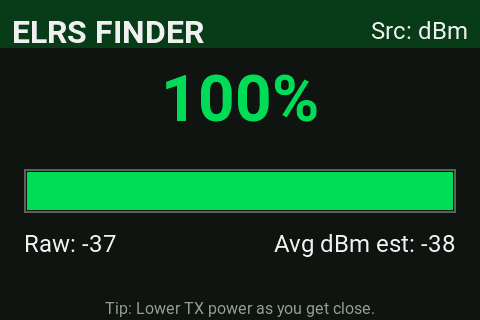
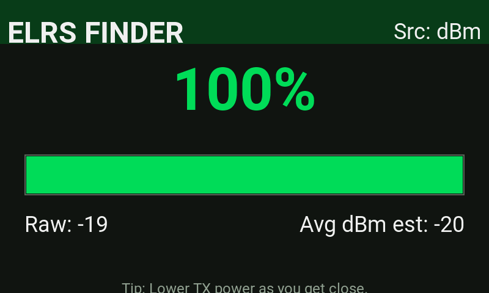

# EdgeTX Lua Scripts (Color Screen Optimized)

An **EdgeTX Lua script** for Radiomaster, Jumper, and other EdgeTX radios, optimized for **color displays** like the TX16S and TX15.

Layouts scale from `LCD_W`/`LCD_H`, so the same file renders correctly across different color screen resolutions. Requires **EdgeTX 2.8+** (uses `lcd.RGB()`).

> Flying a black-and-white radio (Boxer, Pocket, GX12)? Use the original [edgetx-lua-scripts-bw](https://github.com/iamsunilchahal/edgetx-lua-scripts-bw) by [Sunil Chahal](https://github.com/iamsunilchahal) instead.

## 📂 Repository Structure

```
SCRIPTS/
└── TOOLS/
    └── ELRS_Finder_Color.lua    # Tool accessible via SYS → Tools menu
screenshots/                     # README images
LICENSE
README.md
```

Copy the `SCRIPTS` folder directly to your radio's **SD card root**.

## 📜 Available Scripts

### 1. [ELRS_Finder_Color.lua](SCRIPTS/TOOLS/ELRS_Finder_Color.lua)

**Type:** Tool (`/SCRIPTS/TOOLS/`)
**Purpose:**
An **RSSI-based lost model finder** using ELRS/CRSF telemetry. Geiger-counter style — the closer you get to your quad, the faster it beeps.

- Large color-coded strength readout: red (weak) → yellow → green (strong)
- Full-width signal bar plus raw and averaged dBm values
- Beep cadence tightens from one per 1.2 s to 10 per second as you close in
- Three-level telemetry fallback so it works across ELRS setups

**How it reads signal:**

1. **1RSS** — CRSF RSSI in dBm (preferred)
2. **RSNR** — link SNR, rescaled to a dBm estimate
3. **RQly** — link quality %, rescaled as a last resort

The value is smoothed with an exponential moving average, mapped to a 0–100% strength, and drives both the display and the beep cadence.

**Installation:**

1. Copy `ELRS_Finder_Color.lua` into `/SCRIPTS/TOOLS/` on your SD card.
2. On your radio:
   - Long-press `SYS` → **Tools** tab → run **ELRS Finder Color**

**For best results:**

- Set a **fixed low TX power** (10–25 mW) in the ELRS menu before you start walking. At full power RSSI saturates and everything reads "strong" — low power is what makes the Geiger effect useful.
- Sweep the radio slowly and follow the signal peaks.
- **Lower TX power further as you get close** to keep resolution in the last few meters.
- The quad's battery must still be connected — this works off the live ELRS link, not a beacon.

**Verified on:**

| Radio | Screen | Status |
|---|---|---|
| Radiomaster TX15 | 480×320 color | ✅ Tested |
| Radiomaster TX16S MKIII | 800×480 color | ✅ Tested |





**Credit:** Adapted from [ELRS_Finder.lua](https://github.com/iamsunilchahal/edgetx-lua-scripts-bw/blob/main/SCRIPTS/TOOLS/ELRS_Finder.lua) by [Sunil Chahal](https://github.com/iamsunilchahal) (MIT). The finder logic is unchanged — only the display layout was redesigned for color screens.

## 📥 Installation for All Scripts

1. Download this repository:
   - **Option A:** Click the green **Code** button → **Download ZIP**
   - **Option B:** Clone via Git (`git clone https://github.com/iamnoland/edgetx-lua-scripts-color.git`)
2. Extract and copy the `SCRIPTS` folder to the root of your EdgeTX SD card.
3. Access scripts from the **Tools menu** (long-press `SYS` → Tools).

## 📄 License

MIT — see [LICENSE](LICENSE). Original finder logic © 2025 Sunil Chahal; color adaptation © 2026 Ray Noland / [FPV Guidebook](https://fpv-guidebook.com). Use, modify, and share freely — please keep the attribution.

✈️ Built and tested in Berlin by [FPV Guidebook](https://fpv-guidebook.com) — an independent FPV reference app.
